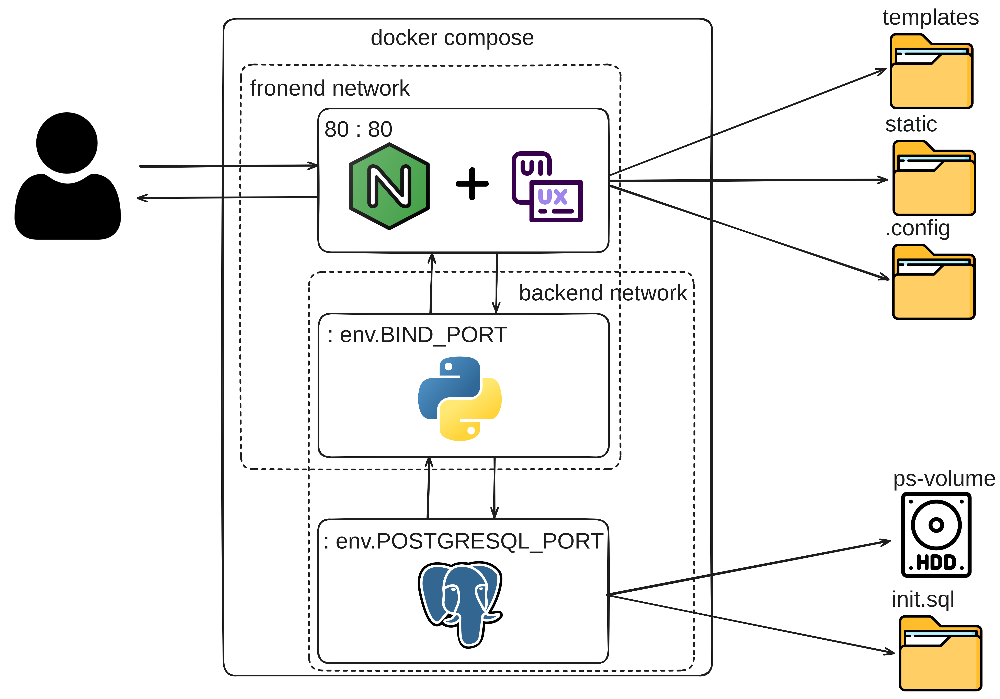

# About

This project uses Docker Compose to set up a Flask application with a PostgreSQL backend, and it places the application behind Nginx. For more details about the Gutendex app, refer to `project/readme.md`.

# Architecture Diagram



# Prerequisites

- Docker
- Docker Compose

# How to Launch

1. **Create a `.env` File**

  - Copy the example `.env` file: `project/gutendex/.env.template`
  - Follow the instructions in `project/installation-guide.md` to configure the `.env` file.

2. **Build and Start the Application**

  Run the following command to build the Docker images and start the containers:

  ```sh
  docker compose up --build

3. __Access the Application__ 

  Once the containers are up and running, the app will be accessible at http://localhost.
